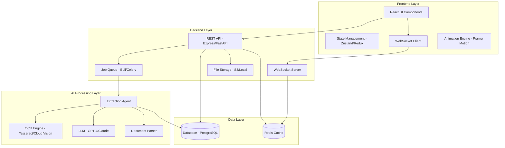
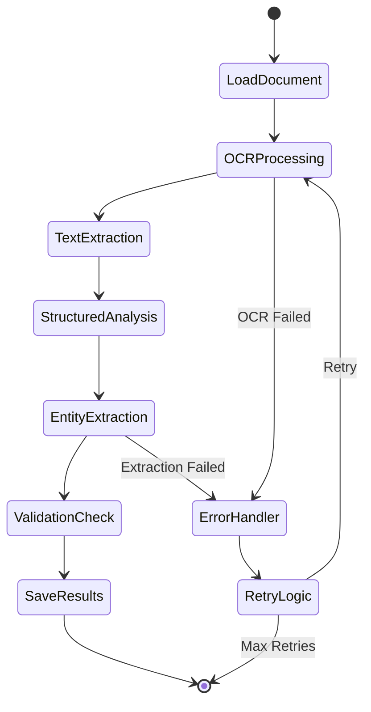
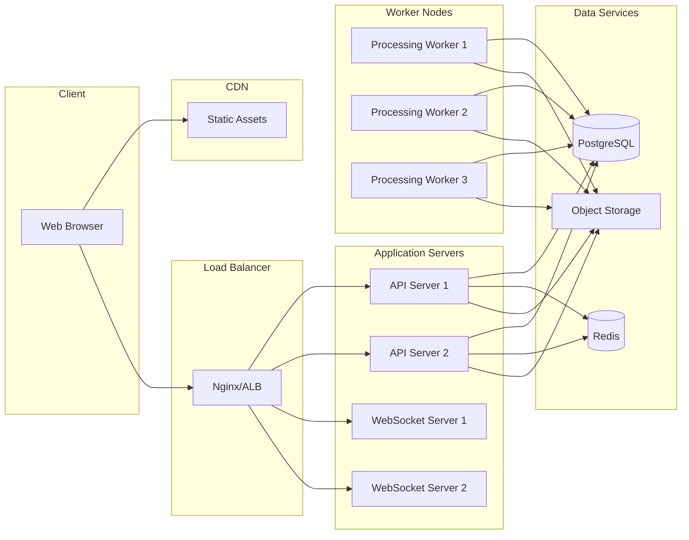

# Medical Document Extraction System - Design Document

## Overview

The Medical Document Extraction System is a web-based application that leverages AI agents to automatically extract structured medical information from unstructured documents (medical reports, prescriptions, lab results). The system emphasizes user experience through real-time visual feedback, smooth animations, and transparent background process visualization.

### Key Design Principles

1. **Transparency**: Users should always understand what the system is doing
2. **Visual Feedback**: Every action and process should have corresponding visual indicators
3. **Progressive Enhancement**: Show results as they become available rather than waiting for complete processing
4. **Error Resilience**: Gracefully handle failures with clear recovery paths
5. **Accessibility**: Ensure animations can be disabled and information is accessible to all users

## Architecture

### System Architecture



### Technology Stack

**Frontend:**
- React 18+ with TypeScript
- Framer Motion for animations
- TailwindCSS for styling
- Zustand or Redux for state management
- React Query for data fetching
- WebSocket client for real-time updates

**Backend:**
- Node.js with Express OR Python with FastAPI
- WebSocket server (Socket.io or native WebSocket)
- Bull (Node.js) or Celery (Python) for job queue
- PostgreSQL for structured data storage
- Redis for caching and real-time data
- AWS S3 or local storage for document files

**AI/ML:**
- OpenAI GPT-4 or Anthropic Claude for extraction
- Tesseract OCR or Google Cloud Vision API
- LangChain or custom agent framework
- PDF parsing libraries (pdf-parse, PyPDF2)

## Components and Interfaces

### Frontend Components

#### 1. Document Upload Component

**Purpose**: Handle file selection, validation, and upload initiation

**Key Features:**
- Drag-and-drop zone with hover animations
- File type and size validation
- Upload progress bar with percentage
- Multiple file queue management
- Preview thumbnails for uploaded documents

**Props Interface:**
```typescript
interface UploadComponentProps {
  onUploadComplete: (fileId: string) => void;
  onUploadError: (error: Error) => void;
  maxFileSize: number;
  acceptedFormats: string[];
}
```

#### 2. Processing Visualization Component

**Purpose**: Display real-time processing status with animations

**Key Features:**
- Multi-stage progress indicator (Upload → OCR → Analysis → Extraction → Validation)
- Animated stage transitions
- Current stage highlighting with pulsing effect
- Estimated time remaining
- Activity log showing extraction events
- Animated document preview with highlighted regions being processed

**State Interface:**
```typescript
interface ProcessingState {
  currentStage: 'uploading' | 'ocr' | 'analyzing' | 'extracting' | 'validating' | 'complete';
  progress: number; // 0-100
  estimatedTimeRemaining: number; // seconds
  activityLog: ActivityLogEntry[];
  extractedItemsCount: {
    demographics: number;
    medications: number;
    diagnoses: number;
    labResults: number;
  };
}
```

#### 3. Extraction Results Component

**Purpose**: Display extracted information in organized, editable format

**Key Features:**
- Tabbed or accordion sections for different data categories
- Confidence indicators (color-coded badges)
- Inline editing with validation
- Side-by-side view with original document
- Highlight synchronization between extracted data and source document
- Animated entry of extracted items (stagger effect)

**Data Interface:**
```typescript
interface ExtractionResult {
  documentId: string;
  patientInfo: PatientDemographics;
  medications: Medication[];
  diagnoses: Diagnosis[];
  labResults: LabResult[];
  vitalSigns: VitalSign[];
  metadata: {
    extractedAt: Date;
    processingTime: number;
    overallConfidence: number;
  };
}
```

#### 4. Animation Components

**Purpose**: Reusable animated elements for consistent UX

**Components:**
- `<PulseLoader />`: Pulsing animation for active processing
- `<ProgressRing />`: Circular progress indicator
- `<StaggeredList />`: List items that animate in sequence
- `<ConfidenceMeter />`: Animated confidence level indicator
- `<CountUp />`: Animated number counter
- `<SlidePanel />`: Sliding panel transitions
- `<HighlightOverlay />`: Animated highlight on document regions

### Backend Components

#### 1. Upload Handler

**Purpose**: Receive, validate, and store uploaded documents

**Responsibilities:**
- File validation (type, size, content)
- Generate unique document ID
- Store file in object storage
- Create database record
- Enqueue processing job
- Return upload confirmation

**API Endpoint:**
```
POST /api/documents/upload
Content-Type: multipart/form-data

Response:
{
  "documentId": "uuid",
  "status": "queued",
  "queuePosition": 3
}
```

#### 2. Processing Job Queue

**Purpose**: Manage asynchronous document processing tasks

**Job Structure:**
```typescript
interface ProcessingJob {
  jobId: string;
  documentId: string;
  priority: number;
  retryCount: number;
  maxRetries: 3;
  status: 'queued' | 'processing' | 'completed' | 'failed';
  stages: {
    ocr: StageStatus;
    analysis: StageStatus;
    extraction: StageStatus;
    validation: StageStatus;
  };
}
```

**Queue Configuration:**
- Concurrency: 3-5 jobs simultaneously
- Retry strategy: Exponential backoff (1s, 2s, 4s)
- Job timeout: 5 minutes per document
- Priority levels: urgent, normal, low

#### 3. WebSocket Event Handler

**Purpose**: Push real-time updates to connected clients

**Event Types:**
```typescript
// Server → Client events
type ServerEvents = {
  'processing:started': { documentId: string; estimatedTime: number };
  'processing:stage': { documentId: string; stage: string; progress: number };
  'processing:activity': { documentId: string; activity: ActivityLogEntry };
  'processing:item-extracted': { documentId: string; itemType: string; item: any };
  'processing:completed': { documentId: string; result: ExtractionResult };
  'processing:error': { documentId: string; error: ErrorDetails };
};

// Client → Server events
type ClientEvents = {
  'subscribe': { documentId: string };
  'unsubscribe': { documentId: string };
};
```

#### 4. Extraction Agent

**Purpose**: Orchestrate the AI-powered extraction process

**Agent Workflow:**



**Agent Components:**

1. **Document Loader**: Load and preprocess document
2. **OCR Processor**: Extract text from images/PDFs
3. **Text Analyzer**: Identify document structure and sections
4. **Entity Extractor**: Use LLM to extract structured data
5. **Validator**: Verify extracted data quality and completeness
6. **Result Formatter**: Structure data for storage and display

**LLM Prompt Strategy:**

```
System: You are a medical information extraction specialist. Extract structured data from medical documents with high accuracy.

User: Extract the following information from this medical document:
- Patient demographics (name, DOB, ID)
- Medications (name, dosage, frequency, duration)
- Diagnoses and conditions
- Lab results (test name, value, unit, reference range)
- Vital signs
- Physician information

Document text:
{ocr_text}

Return the data in JSON format with confidence scores for each field.
```

## Data Models

### Database Schema

#### Documents Table
```sql
CREATE TABLE documents (
  id UUID PRIMARY KEY,
  filename VARCHAR(255) NOT NULL,
  file_path TEXT NOT NULL,
  file_size INTEGER NOT NULL,
  mime_type VARCHAR(100) NOT NULL,
  upload_status VARCHAR(50) NOT NULL,
  processing_status VARCHAR(50) NOT NULL,
  uploaded_at TIMESTAMP DEFAULT NOW(),
  processed_at TIMESTAMP,
  created_by UUID REFERENCES users(id),
  metadata JSONB
);
```

#### Extraction Results Table
```sql
CREATE TABLE extraction_results (
  id UUID PRIMARY KEY,
  document_id UUID REFERENCES documents(id),
  patient_info JSONB,
  medications JSONB,
  diagnoses JSONB,
  lab_results JSONB,
  vital_signs JSONB,
  raw_extraction JSONB,
  confidence_scores JSONB,
  extracted_at TIMESTAMP DEFAULT NOW(),
  processing_time_ms INTEGER
);
```

#### Processing Jobs Table
```sql
CREATE TABLE processing_jobs (
  id UUID PRIMARY KEY,
  document_id UUID REFERENCES documents(id),
  status VARCHAR(50) NOT NULL,
  current_stage VARCHAR(50),
  progress INTEGER DEFAULT 0,
  retry_count INTEGER DEFAULT 0,
  error_message TEXT,
  started_at TIMESTAMP,
  completed_at TIMESTAMP,
  metadata JSONB
);
```

### TypeScript Interfaces

```typescript
interface PatientDemographics {
  name: string;
  dateOfBirth: string;
  patientId: string;
  gender?: string;
  age?: number;
  confidence: number;
}

interface Medication {
  drugName: string;
  dosage: string;
  frequency: string;
  duration?: string;
  route?: string;
  prescribedDate?: string;
  confidence: number;
}

interface Diagnosis {
  condition: string;
  icdCode?: string;
  diagnosedDate?: string;
  severity?: string;
  confidence: number;
}

interface LabResult {
  testName: string;
  value: string;
  unit: string;
  referenceRange?: string;
  abnormalFlag?: boolean;
  testDate?: string;
  confidence: number;
}

interface VitalSign {
  type: 'blood_pressure' | 'heart_rate' | 'temperature' | 'respiratory_rate' | 'oxygen_saturation';
  value: string;
  unit: string;
  measuredAt?: string;
  confidence: number;
}

interface ActivityLogEntry {
  timestamp: Date;
  stage: string;
  action: string;
  details?: string;
  icon?: string;
}
```

## Error Handling

### Error Categories

1. **Validation Errors**: Invalid file format, size exceeded, corrupted file
2. **Processing Errors**: OCR failure, LLM timeout, parsing errors
3. **System Errors**: Database connection, storage failure, queue overflow
4. **Business Logic Errors**: Insufficient data extracted, low confidence results

### Error Handling Strategy

**Frontend:**
- Display user-friendly error messages with suggested actions
- Provide retry buttons for recoverable errors
- Show detailed error information in expandable sections
- Maintain error state in UI without losing user context
- Animate error messages with attention-grabbing transitions

**Backend:**
- Log all errors with context (document ID, stage, timestamp)
- Implement retry logic with exponential backoff
- Preserve partial results when possible
- Send error notifications via WebSocket
- Return structured error responses

**Error Response Format:**
```typescript
interface ErrorResponse {
  error: {
    code: string;
    message: string;
    details?: any;
    recoverable: boolean;
    suggestedAction?: string;
  };
}
```

### Retry Strategy

- **OCR Failures**: Retry up to 3 times with different preprocessing
- **LLM Timeouts**: Retry with reduced context or simpler prompts
- **Network Errors**: Exponential backoff (1s, 2s, 4s)
- **Partial Extraction**: Continue with available data, mark missing fields

## Animation Design

### Animation Principles

1. **Purpose-Driven**: Every animation serves a functional purpose
2. **Performance**: Use CSS transforms and opacity for 60fps animations
3. **Accessibility**: Respect `prefers-reduced-motion` media query
4. **Timing**: Fast interactions (100-200ms), medium transitions (300-400ms), slow reveals (500-800ms)

### Key Animations

#### 1. Upload Animation
- Drag-over: Scale up drop zone (1.02x) with border pulse
- File added: Slide in from bottom with fade
- Upload progress: Smooth progress bar fill with gradient shift

#### 2. Processing Stage Transitions
- Stage completion: Check mark animation with scale bounce
- Stage activation: Pulse effect with color transition
- Progress bar: Smooth width transition with easing

#### 3. Extraction Item Reveal
- Staggered fade-in: Each item appears 50ms after previous
- Slide from left: 20px translation with fade
- Confidence meter: Animated fill from 0 to actual value

#### 4. Document Highlight
- Highlight overlay: Fade in yellow overlay on source document
- Pulse effect: Subtle scale animation (1.0 to 1.02)
- Sync scroll: Smooth scroll to highlighted region

#### 5. Error States
- Shake animation: Horizontal shake for validation errors
- Fade to red: Color transition for error states
- Expand details: Height animation for error message reveal

### Framer Motion Configuration

```typescript
const animationVariants = {
  staggerContainer: {
    hidden: { opacity: 0 },
    show: {
      opacity: 1,
      transition: {
        staggerChildren: 0.05
      }
    }
  },
  staggerItem: {
    hidden: { opacity: 0, x: -20 },
    show: { opacity: 1, x: 0 }
  },
  pulseRing: {
    scale: [1, 1.2, 1],
    opacity: [0.5, 0.8, 0.5],
    transition: {
      duration: 2,
      repeat: Infinity,
      ease: "easeInOut"
    }
  },
  slidePanel: {
    hidden: { x: "100%" },
    visible: { x: 0, transition: { type: "spring", damping: 25 } }
  }
};
```

## Testing Strategy

### Unit Testing

**Frontend:**
- Component rendering tests (React Testing Library)
- Animation behavior tests (mock Framer Motion)
- State management tests (Zustand/Redux)
- Utility function tests

**Backend:**
- API endpoint tests (Jest/Pytest)
- Job queue processing tests
- Database operation tests
- Extraction agent logic tests

### Integration Testing

- End-to-end upload and processing flow
- WebSocket communication tests
- Database and cache integration
- External API integration (OCR, LLM)

### E2E Testing

- Complete user workflows (Playwright/Cypress)
- Upload → Process → Review → Export flow
- Error handling and recovery scenarios
- Multi-document processing
- Real-time update synchronization

### Performance Testing

- Document processing time benchmarks
- Concurrent user load testing
- Animation performance (FPS monitoring)
- Memory leak detection
- Database query optimization

### Test Data

- Sample medical reports (anonymized)
- Various document formats (PDF, JPEG, PNG)
- Edge cases (poor quality scans, handwritten notes)
- Multi-page documents
- Documents with missing information

## Security Considerations

1. **Data Privacy**: Encrypt documents at rest and in transit
2. **Authentication**: Implement user authentication and authorization
3. **HIPAA Compliance**: Follow healthcare data protection standards
4. **Input Validation**: Sanitize all user inputs and file uploads
5. **Rate Limiting**: Prevent abuse of upload and processing endpoints
6. **Audit Logging**: Track all document access and modifications

## Performance Optimization

1. **Lazy Loading**: Load components and data on demand
2. **Code Splitting**: Split bundle by routes and features
3. **Image Optimization**: Compress and resize document previews
4. **Caching**: Cache extraction results and frequently accessed data
5. **CDN**: Serve static assets from CDN
6. **Database Indexing**: Index frequently queried fields
7. **Connection Pooling**: Reuse database and API connections

## Deployment Architecture



## Future Enhancements

1. **Batch Processing**: Upload and process multiple documents simultaneously
2. **Template Recognition**: Identify document types and apply specialized extraction
3. **Historical Tracking**: Track changes to extracted data over time
4. **Collaborative Review**: Multiple users can review and validate extractions
5. **Mobile App**: Native mobile application for document capture
6. **Voice Annotations**: Add voice notes to extracted data
7. **Integration APIs**: Connect with EHR systems and other healthcare platforms
8. **Advanced Analytics**: Insights and trends from extracted medical data
